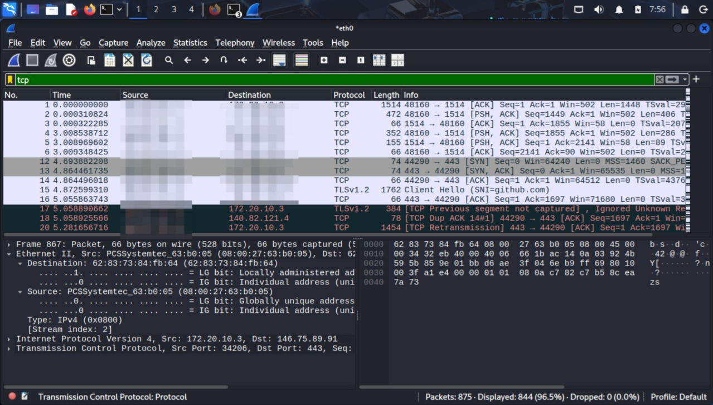
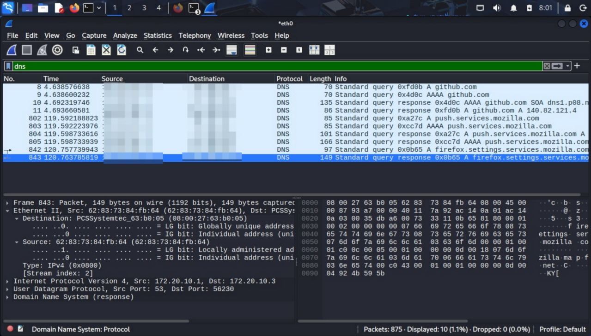
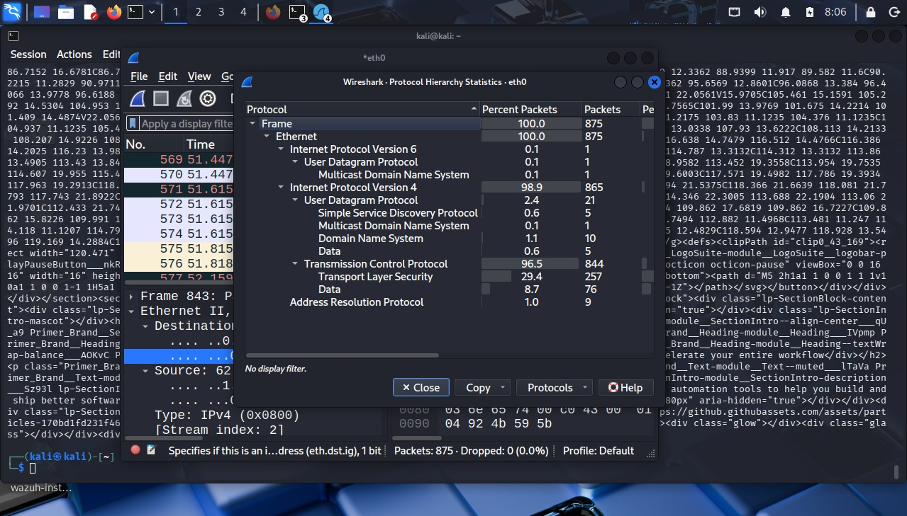

# 🌐 Wireshark Network Traffic Analysis

##  Project Overview

This project demonstrates practical network traffic analysis using Wireshark. The objective was to capture and inspect packets, identify common protocols, understand communication flows, and recognize potentially suspicious behavior.

Packet analysis is a critical skill for SOC analysts when investigating alerts, network anomalies, and security incidents.

---

##  Objectives

* Capture live network traffic
* Identify common protocols
* Analyze communication behavior
* Review source and destination activity
* Detect suspicious indicators

---

## 🧰 Tools Used

* Wireshark
* Linux / Windows Lab Environment
* Web Browser
* Command Line Utilities

---

## 🔍 Protocols Observed

| Protocol     | Purpose                          |
| ------------ | -------------------------------- |
| DNS          | Domain name resolution           |
| HTTP / HTTPS | Web traffic                      |
| TCP          | Reliable communication           |
| UDP          | Fast connectionless traffic      |
| ICMP         | Connectivity testing             |
| ARP          | Local network address resolution |

---

## 📈 Analysis Activities Performed

* Captured network packets during browsing activity
* Filtered traffic by protocol
* Reviewed TCP handshakes
* Examined DNS queries
* Observed HTTP/HTTPS sessions
* Identified source and destination addresses
* Monitored packet timing and flow behavior

---

## 🚨 Suspicious Indicators Reviewed

* Excessive repeated connections
* Unknown external IP communication
* Port scanning behavior
* Large traffic spikes
* Failed connection attempts
* Unusual DNS requests

---

##  Skills Demonstrated

* Packet Analysis
* Protocol Identification
* Traffic Filtering
* Threat Hunting Awareness
* Network Troubleshooting
* SOC Investigation Skills

---

## 📸 Screenshots

### TCP Traffic Review

Filtered captured traffic to TCP packets and reviewed active sessions, encrypted communications, acknowledgments, and retransmission behavior.

### DNS Traffic Review

Reviewed DNS queries generated during browsing activity to observe domain resolution behavior.

### Protocol Hierarchy Statistics

Used Wireshark statistics to analyze traffic composition across IPv4, TCP, TLS, DNS, UDP, and ARP protocols to establish 

---

##  Key Findings

* Observed active TCP communications including encrypted HTTPS traffic over port 443.
* Identified duplicate ACK and retransmission packets, which may indicate packet loss, latency, or unstable connectivity.
* Confirmed DNS activity used for domain resolution during browsing sessions.
* Protocol Hierarchy showed TCP as dominant traffic type with TLS-encrypted sessions present.

---

##  Mock SOC Analyst Observation

During packet review, duplicate ACK and retransmission events were observed within active TCP sessions. These behaviors may indicate degraded network performance, congestion, or packet delivery issues. No clear evidence of malicious activity was identified during this capture, but continued monitoring would be recommended in a production environment.

---

##  Conclusion

This project demonstrates foundational network visibility and packet analysis skills essential for cybersecurity analysts and SOC environments. Understanding normal and abnormal traffic patterns improves incident detection and investigation effectiveness.
