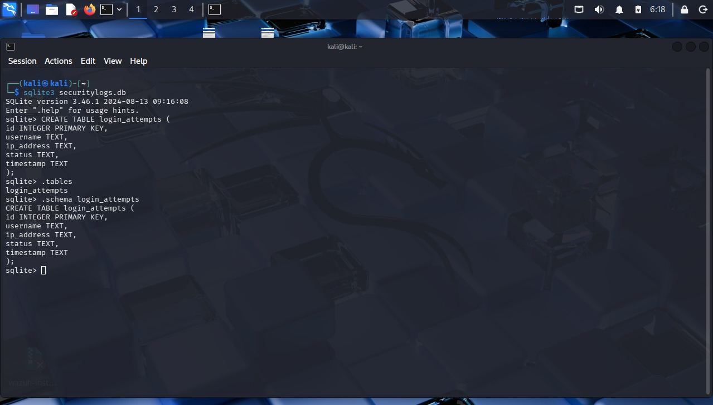
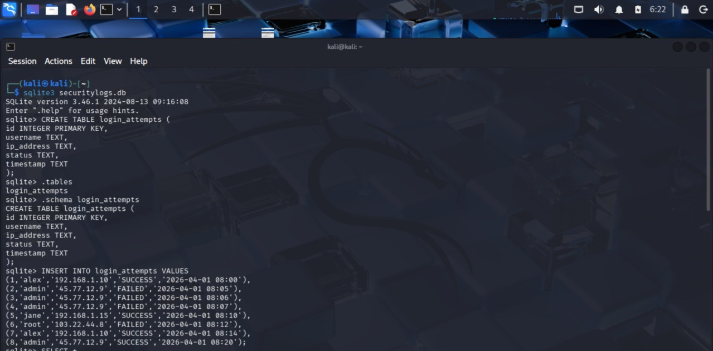
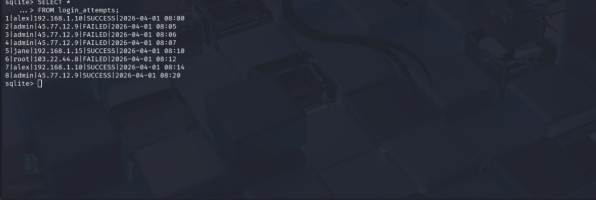
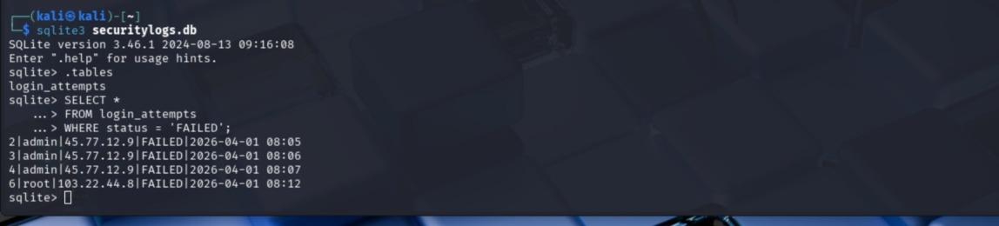
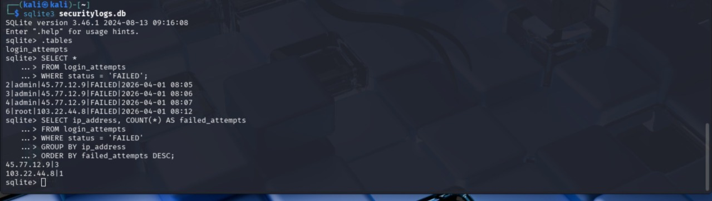
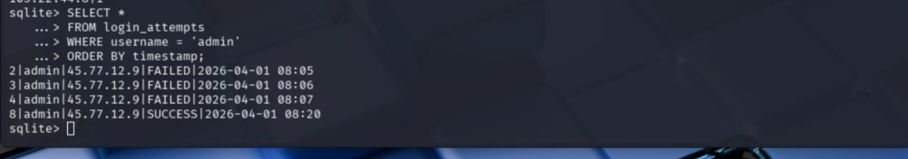

# SQL Security Log Analysis

## Project Overview

This project demonstrates how SQL can be used in cybersecurity to analyze authentication logs, investigate suspicious login activity, and support Security Operations Center (SOC) monitoring processes.

A sample login activity database was created using SQLite to simulate real-world user authentication events such as successful logins, failed attempts, repeated failures, and suspicious external IP activity.

SQL is commonly used by cybersecurity analysts for log analysis, threat hunting, reporting, and identifying unusual behavior across systems.

---

## Objectives

* Create a structured login activity database
* Query failed login attempts
* Identify suspicious IP addresses
* Detect repeated authentication failures
* Review successful logins after failures
* Demonstrate analyst-style investigations using SQL

---

## Tools Used

* SQLite
* Kali Linux
* Command Line Interface
* SQL Queries

---

## Database Table Creation

Created a table named `login_attempts` with the following fields:

* `id`
* `username`
* `ip_address`
* `status`
* `timestamp`

### Screenshot



---

## Inserted Sample Log Data

Added simulated authentication records including:

* Successful user logins
* Failed login attempts
* Repeated failed admin logins
* Suspicious external IP activity

### Screenshots





---

## Security Query 1: Failed Login Attempts

Used SQL to review all failed authentication attempts.

```sql
SELECT * FROM login_attempts
WHERE status = 'FAILED';
```

### Screenshot



---

## Security Query 2: Suspicious IP Analysis

Used aggregation to identify IP addresses responsible for repeated failed login attempts.

```sql
SELECT ip_address, COUNT(*) AS failed_attempts
FROM login_attempts
WHERE status = 'FAILED'
GROUP BY ip_address
ORDER BY failed_attempts DESC;
```

### Screenshot



---

## Security Query 3: Admin Login Timeline

Reviewed login history for the `admin` account to identify suspicious activity patterns.

```sql
SELECT * FROM login_attempts
WHERE username = 'admin'
ORDER BY timestamp;
```

### Screenshot



---

## Key Findings

* Multiple failed login attempts originated from the same external IP address.
* Repeated failed attempts against the `admin` account may indicate brute-force behavior.
* Authentication logs can quickly reveal suspicious activity patterns when queried properly.
* SQL provides fast visibility for incident investigations and security reporting.

---

## Skills Demonstrated

* SQL SELECT Statements
* WHERE Filtering
* GROUP BY Aggregation
* COUNT Analysis
* Authentication Log Review
* Threat Hunting Fundamentals
* SOC Investigation Workflow
* Security Reporting

---

## Conclusion

This project demonstrates how SQL can be applied in cybersecurity to investigate login events, detect suspicious behavior, and support security monitoring operations. Structured querying of log data is a valuable skill for SOC analysts and cybersecurity professionals.
